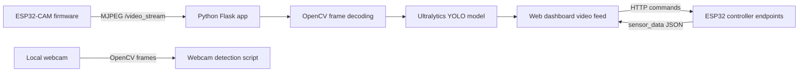

# Smart Fire Detection System

An AI-assisted fire detection prototype that uses YOLO-based computer vision to identify fire in camera frames, with an ESP32-CAM MJPEG stream and a Flask monitoring/control interface.

## Overview

Early fire detection can reduce response time when a camera is already watching an area. This project combines Python, OpenCV, Ultralytics YOLO, an ESP32-CAM video stream, and a web interface for monitoring annotated frames and forwarding control commands to an ESP32-based robot/controller.

This repository contains prototype code. It is not a certified fire-safety or life-safety system.

## Features

- YOLO fire detection on a local webcam.
- YOLO fire detection on an ESP32-CAM MJPEG stream.
- Bounding-box visualization using Ultralytics result plotting.
- Flask dashboard that serves the processed video stream.
- Dashboard controls for movement, pan/tilt servo commands, pump on/off, and manual/auto mode requests.
- Sensor polling endpoint for temperature, humidity, and fire status reported by an ESP32 HTTP endpoint.
- ESP32-CAM firmware that exposes `/video_stream` as an MJPEG stream.

## System Architecture



## Detection Pipeline

Camera frames are captured from either a local webcam or the ESP32-CAM MJPEG stream. The Python code decodes each frame with OpenCV, resizes ESP32-CAM frames to 640x480, runs YOLO inference, applies the configured confidence threshold, draws detections, and displays or streams the annotated result.

## Tech Stack

| Layer | Technology |
|-------|------------|
| Computer Vision | Ultralytics YOLO, OpenCV |
| Language | Python |
| Web Interface | Flask, HTML, CSS, JavaScript |
| Camera | ESP32-CAM MJPEG stream, local webcam |
| Embedded | Arduino/ESP32-CAM C++ sketch |
| Model File | PyTorch `.pt` checkpoint |

## Repository Structure

```text
src/
  app.py                    Flask monitoring/control app
  config.py                 Environment-based configuration
  webcam_fire_detection.py  Local webcam inference entry point
web/templates/
  index.html                Flask dashboard template
firmware/esp32_cam/
  cam.ino                   ESP32-CAM MJPEG streaming firmware
models/
  README.md                 Model checkpoint notes
docs/
  architecture.md           Architecture notes
  hardware.md               Hardware notes from implemented code
```

## Installation

```bash
git clone https://github.com/FAHADKHAN8/Smart-Fire-Detection-System-.git
cd Smart-Fire-Detection-System-
python -m venv .venv
```

Windows:

```powershell
.venv\Scripts\activate
```

Linux/macOS:

```bash
source .venv/bin/activate
```

Install dependencies:

```bash
pip install -r requirements.txt
```

Python 3.10-3.12 is recommended because computer vision and ML packages may lag behind the newest Python releases.

## Configuration

Copy `.env.example` to `.env` if you use a dotenv workflow, or set the variables directly in your shell.

```text
MODEL_PATH=models/fire.pt
ESP32_BASE_URL=http://192.168.4.1
ESP32_CAM_BASE_URL=http://192.168.4.3
CAMERA_STREAM_PATH=/video_stream
CONFIDENCE_THRESHOLD=0.25
```

The current Python code reads environment variables directly. Install and load `python-dotenv` yourself if you want automatic `.env` loading.

## Model Setup

Place the YOLO checkpoint at:

```text
models/fire.pt
```

or set `MODEL_PATH` to another checkpoint path. See `models/README.md` for details.

## Running the Project

Run local webcam detection:

```bash
python src/webcam_fire_detection.py
```

Run the Flask dashboard for ESP32-CAM streaming and ESP32 control:

```bash
python src/app.py
```

Then open:

```text
http://localhost:5000
```

The dashboard expects an ESP32-CAM stream at `ESP32_CAM_BASE_URL + CAMERA_STREAM_PATH` and ESP32 controller endpoints at `ESP32_BASE_URL`.

## Hardware

Confirmed by repository code:

- ESP32-CAM configured with AI Thinker-style camera pins.
- ESP32-CAM HTTP server exposing `/video_stream`.
- A separate ESP32/controller is expected by the Flask app for `/move`, `/servo`, `/pump`, `/mode`, and `/sensor_data` HTTP endpoints.
- Dashboard labels and endpoints indicate temperature, humidity, fire status, movement, pan/tilt servos, and pump control, but the matching ESP32 controller firmware is not present in this repository.

## Model / Dataset

The Python code uses the `ultralytics` package and loads a `.pt` checkpoint through `YOLO(...)`. The repository did not contain a reproducible training script, dataset manifest, or evaluation report during this cleanup, so no quantitative accuracy result is claimed here.

## Results

The implemented result path is qualitative: YOLO detections are rendered as bounding boxes on webcam or ESP32-CAM frames. No verifiable test methodology or metrics artifact was found in the repository, so the previously reported approximate accuracy is intentionally omitted.

## Limitations

- This is an academic/prototype system, not a certified life-safety device.
- Visual fire detection can confuse flames with bright or orange objects.
- Performance depends on camera quality, lighting, network stability, model size, and host hardware.
- The ESP32 controller firmware for robot movement, sensors, pump, and mode handling is referenced by the dashboard/backend but is not included.
- The model training and evaluation workflow is not reproducible from the current repository alone.

## Future Improvements

- Add reproducible training and evaluation scripts.
- Add the missing ESP32 controller firmware or document the expected API contract in more detail.
- Add smoke detection or temporal confirmation to reduce false positives.
- Add alert notifications and logging.
- Optimize inference for edge hardware.

## License

This project is released under the MIT License. See `LICENSE`.
